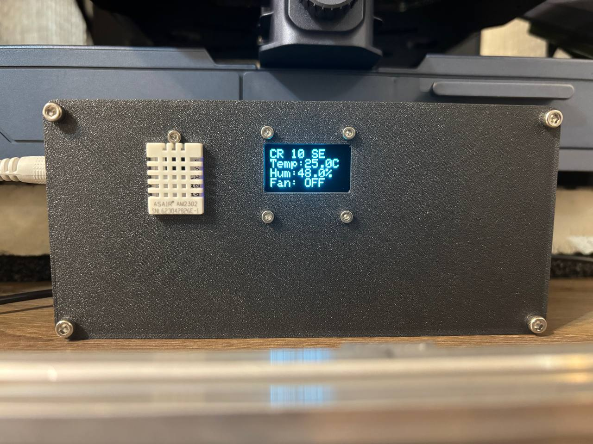

# 3d-printer-enclosure-esp32
An automated 3d printer enclosure monitoring and control system

Features:
- Display temperature, humidity and fan status
- Return temperature, humidity and fan status over the wifi
- Control the fan over the wifi

Photos:

Component used:
- Microcontroller: KS0413 Keyestudio ESP32 Core Board

- IO Shield: Keyestudio IO Shield for ESP32

- Sensor: Waveshare DHT22 (temperature and humidity)

- Fans: Controlled via ESP32 (relays planned)

- Relay: Controlled from GPIO (IO17 confirmed as usable)